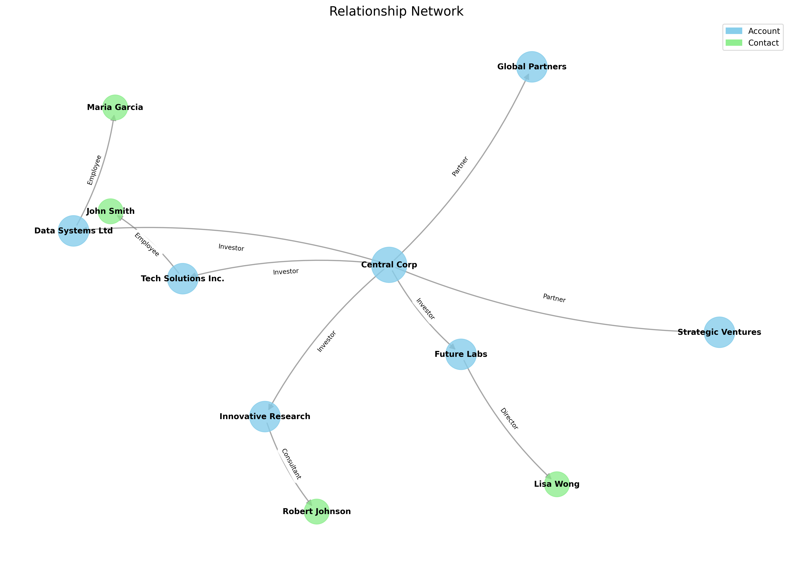

# Graph Relationship Visualizer

A Python tool to visualize relationship graphs from JSON data. This tool is useful for visualizing organizational structures, investment relationships, social networks, and other types of relationship graphs.

## Features

- Visualizes directed graphs from JSON data
- Differentiates between node types using colors (Accounts, Contacts, etc.)
- Shows relationships between nodes with labeled edges
- Highlights central nodes and organizes nodes by level
- Automatically generates and saves high-quality PNG visualizations

## Requirements

- Python 3.6+
- NetworkX
- Matplotlib

## Installation

1. Clone the repository:
```bash
git clone https://github.com/annaaimeri/graph-relationship-visualizer.git
cd graph-relationship-visualizer
```

2. Install the required dependencies:
```bash
pip install networkx matplotlib
```

## Usage

### Basic Usage

Run the script with the default example file:

```bash
python visualize_graph.py
```

### Custom JSON File

Specify your own JSON file:

```bash
python visualize_graph.py path/to/your/graph.json
```

### JSON Format

Your JSON file should have the following structure:

```json
{
  "nodes": [
    {"id": "node_id", "name": "Node Name", "type": "Node Type", "isCentral": true/false, "level": 0/1/2/...},
    ...
  ],
  "edges": [
    {"source": "source_node_id", "target": "target_node_id", "relationship": "Relationship Type"},
    ...
  ]
}
```

## Output

The script generates a visualization and saves it as `graph_visualization.png` in the current directory.

## Example

Here's what a visualization might look like:



## Customization

You can customize the visualization by modifying the following parameters in the script:

- Node colors by changing the `node_colors` dictionary
- Node sizes by modifying the `node_sizes` dictionary
- Layout algorithm by changing the `nx.spring_layout` function
- Output image size via the `figsize` parameter

## License

MIT License - Feel free to use and modify as needed.